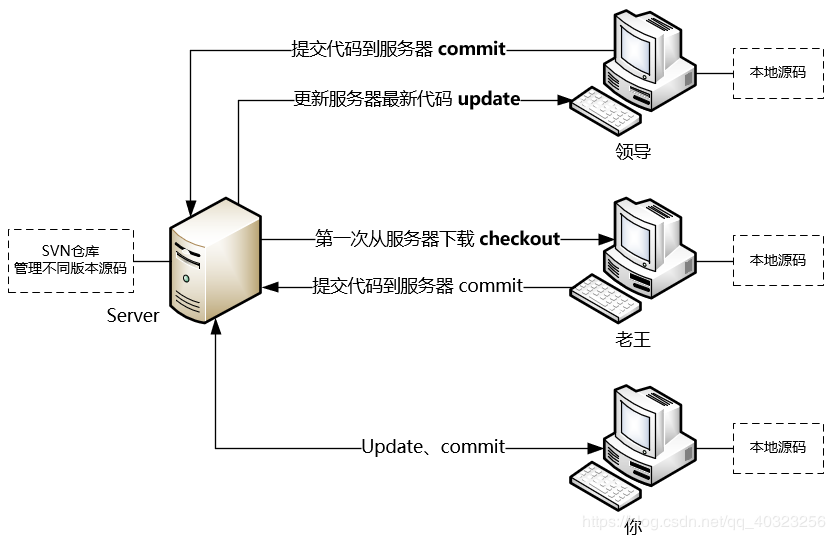

# svn
## svn简介
svn是Subversion的简称，是一个开源的代码版本控制系统，svn就是用于多人共同开发同一个项目，达到资源共用目的工具。

### 版本控制是什么？

版本控制（Revision control）是指对软件开发过程中各种程序代码、配置文件及说明文档等文件变更的管理。可记录每个版本的信息，方便问题追踪。同时版本控制还支持并行开发，可有效的提高开发效率。

### 为什么要使用SVN？
1.项目备份方便，节省硬盘空间；
2.记录每个版本，方便追溯历史纪录。
3.多人协作开发，共享数据；
4.细节化的权限控制，便于管理员掌控项目整体。

## 2.Svn服务端和客户端获取方式
服务端：https://www.visualsvn.com/server/download/
客户端：https://tortoisesvn.net/downloads.html

## 3.svn工作流程和架构图；
### 3.1 svn工作方式：

### 3.2 svn架构图：

## 4.操作svn服务器的2种方式
### 4.1  command-line 命令行方式；
### 4.2  GUI-client图形界面方式；
#### 4.2.1 svn服务连接方式：
1. internet网络连接：
   - apache服务器；
   - svn服务器；
2. local 本地连接：

#### 4.2.2 svn数据存储方式：
- 文件方式：FSFS（推荐使用）
- 数据库方式：BerkeleyDB（伯克利DB）

## 5.svn服务器目录结构、用户和权限；
### 5.1 目录结构：
- Repositories 仓库：存放被svn管理的项目文件，可以存放源码，文档等；
- Users 用户：创建和编辑用户；
- Groups 权限组：创建和编辑用户组；

打开VisualAVN Server步骤：在SVN服务器的安装目录下进入bin文件夹，双击VisualAVN Server.msc即可弹出VisualAVN Server窗口。

### 5.2 创建仓库：
- 标准文件夹结构：
    - branches 分支：如果需要测试新技术，或者大范围修改，将主干代码拷贝到分支中进行，测试无误后可以合并到主干中；
    - tags 发布：发布版本要放到tags中；
    - trunk 主干：主要开发目录；jia

创建仓库,命名为helloSvn:

## 6.svn常用操作：
### 6.1 checkout 检出：
初次下载 - 第一次连接svn服务器时候需要下载对应仓库的数据（如果仓库中有数据的话）；

比如现在让文件夹siki连接SVN服务器，方式如下

### 6.2 add 新增：
新增数据到svn服务器；

比如在trunk文件夹下面新建一个Item.java文件，将此文件添加到SVN服务器：

### 6.3 update 更新：
更新数据 - 检查svn服务器中的数据是否与本地的数据一致，如果不一致就下载改变/新增部分，同时不会删除本地数据；

比如在另一个lijaing文件夹下面更新SVN服务器的数据，同样要先在lijiang文件夹里面右键【SVN checkout...】

### 6.4 delete 删除：
删除svn的数据（需要搭配commit命令）；

比如删除siki/dev/trunk目录下的Item.java文件，选中【Item.java】-【TortoiseSVN】-【Delete】，然后还没完，一定要记得commit！！！

### 6.5 revert 回滚：
将指定版本的代码回滚到本地，如要提交到服务器需要搭配commit命令；

### 6.6 代码冲突：
在多人同时开发一个类，提交的时候容易出现代码冲突，也可以理解为版本冲突；

## 7.其他操作：
### 7.1 按照版本检出；
右键【TortoiseSVN】-【show log】

### 7.2 账号保存与注销；
在需要注销账号的文件夹里面右键【TortoiseSVN】-【settings】-【Saved Data】-【Clear all】，

### 7.3 代码对比工具；
可以高亮显示不同版本文件的不同之处

### 7.4 下载指定版本号的文件；
比如新来一个队友，要使用某个文件的旧版本

