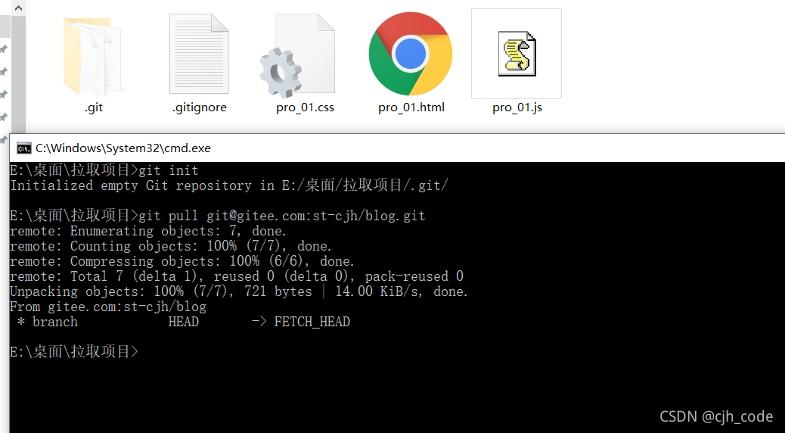

# git

## Git介绍

### 1.Git 简介

#### 什么是Git，它有什么作用？

Git简单来说就是代码版本控制系统，通过他可以进行多人开发同一个项目然后讲每个人的代码块合并完成一个大项目，还能控制代码版本记录等。


#### Git四个区域

1. 工作区：处理工作的区域（即做项目打代码的区域）
2. 暂存区：已完成的工作临时存放区域，等待被提交
3. 本地仓库：存放数据的地方，但是还在本电脑上，若电脑存储空间损坏还是会造成代码消失
4. Git远程仓库：最终的存放区域，即远程服务器，电脑存储空间损坏也不影响远程仓库数据

#### git状态变化

1. 新建文件 —> 未跟踪（Untracked）
2. 使用git add .或者git add ‘需要暂存文件名’ —> 已暂存（Staged）
3. 使用git commit将文件放在本地仓库中 —> 已提交（Unmodified）
4. 如果已经提交到本地仓库后修改了文件当前文件状态是 —> 已修改（Modified）
5. 如果已经提交到本地仓库后删除了文件当前状态是 —> 未跟踪（Untracked）


注意：创建git文件之前就创建一个.gitignore用来忽略文件（忽略你不想上传的文件，里面可利用正则表达式）

### 2..gitignore忽略文件

#### 格式规范

1. 以#开头的是注释
2. 以/结尾的是目录
3. 以/开头防止递归
4. 以!开头表示取反
5. 可以使用glob模式进行文件和文件夹的匹配（glob指简化的正则表达式）

#### glob模式的正则表达式

1. 星号*匹配零个或多个任意字符
2. [abc]匹配任何一个在方括号中的字符（此案例匹配一个a或匹配一个b或匹配一个c）
3. 问号只匹配一个任意字符
4. 在方括号中使用短划线分隔两个字符，表示所有在这两个字符范围内的都可以匹配（比如[0-9]表示匹配所有0到9的数字）
5. 两个星号**表示匹配任意中间目录（比如a/**/z可以匹配a/z、a/b/c或a/b/c/z等）

### 3.操作文件

在项目根目录下利用git init命令创建git本地仓库（显示下面文件表示创建成功）


通过git status查看此目录下文件状态（git status -s简写形式）


上图红色表示文件未被跟踪

通过git add “文件名称”(指定文件放入暂存区) 或者git add .（表示当前所有文件放入暂存区）
.png)

通过git commit -m"文件描述"上传至本地仓库

这说明已经将暂存区的文件传至到本地仓库中了
git commit -a -m“描述消息”这个命令可以跳过暂存区直接存储到本地仓库

我们将其中一个文件信息进行修改


我们修改了pro_01.html中的内容，红色M 表示修改过但没有放入暂存区

我们将修改的文件放入暂存区


绿色的M表示已将修改的文件放入了暂存区

通过git rm --cached 文件名称 移除Git仓库中对应的文件，保留工作区对应的文件


绿色D表示移除的文件，存在红色是因为只移除了本地仓库的文件，工作区的文件未被移除并且处于未被跟踪状态（通过git rm -f 文件名称 来同时移除本地仓库和工作区对应的文件）
通过git log查看所有提交历史（最近的排在最上面）


以上查看的无用信息太多可以用：
git log -2：查看最新两条历史
git log -2 --pretty=oneline：一行显示两条最新历史
git log -2 --oneline：与上个命令一样（对应提交唯一表识长度不一样，比上个命令更短）
git reflog --oneline：与上个命令一样（旧版本一行查看历史）
git log -2 --pretty=format:“%h | %an | %s”：%h提交的简写哈希值 %an作者名 %ar作者修订日期 %s提交说明


通过git reset --hard来跳转到指定历史(CommitID就是提交唯一标识即上图黄色部分)


回到了修改了pro_01.html历史上了，文件夹中删除的pro_01.html又回来了

### 4.上传至云端服务器

远程连接：
本文章用gitee做示例，相同的服务器还github等（国外的稍微有点卡）

1. 先创建一个服务器账号点击新建仓库，创建一个新的云端仓库

    

    

    

2. 建立远程链接


说明已经将项目传至远程服务器中
注意：一定要将文件保存至本地仓库，不然传不上远程服务器

上图说明已经上传至远程服务器

### 从云端拉取项目

拉取远程项目是需在文件内有.git文件即Git本地仓库




git pull命令从远程拉取（远程最新代码），git clone也能从远程克隆下来

## Git分支

git在存储文件时，每一次代码的提交都会创建一个与之对应的节点，git就是通过一个一个的节点来记录代码的状态，节点会构成一个树状结构，树状结构就意味着这个树会存在分支，默认情况下仓库只有一个分支，命名为master，使用git时创建多个分支，分支与分支之间相互独立，在一个分支上修改代码不会影响其他的分支。

### 常用命令

`git branch`：查看当前分支，带*表示当前所处分支

`git branch <分支名称>`：创建分支，只创建不使用

`git checkout` 分支名称：切换分支

`git checkou`t -b分支名称：创建并切换分支

`git merge <branch name>`：合并分支(将c合并给a,需要在a分支上运行命令是复制分支代码,而不是剪切)

`git branch -d 分支名称`：删除分支（代码合并完后再删）

`git branch -D 分支名称`：强制删除，不管你保没保存，没提示的删除（慎用）

注意：删除分支时切走再删（先换船再炸船）

`git switch <branch name>>`：切换至<分支>
`git switch -c <branch name>`：创建并切换至<分支>

## 变基

解决问题：当提交很多后，提交记录会很复杂。

1. 发起变基时，git首先找到共同的祖先。
2. 对比当前分支对于祖先的历史提交，并且将它们提取出存储到一个临时文件里。
3. 将当前部分目标的

## 常见指令

1. 重置文件

    ```shell
    git restore <filename> # 恢复文件
    git restore --staged <filename> # 取消暂存状态
    ```

2. 删除文件

    ```shell
    git rm <filename> # 删除文件
    git rm <filename> # 强制删除
    ```

3. 移动文件

    ```shell
    git rm from to # 移动文件 重命名文件
    ```
